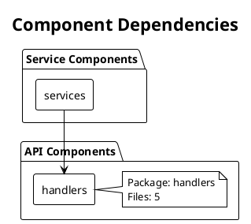

# Руководство по диаграммам PlantUML

Генератор документации автоматически создает диаграммы PlantUML, показывающие зависимости компонентов и архитектуру.

## Возможности

- ✅ **Диаграммы зависимостей компонентов**: Показывает отношения между компонентами/пакетами
- ✅ **Диаграммы архитектуры**: Высокоуровневый вид, организованный по слоям (API, Service, Data)
- ✅ **Автоматическое обнаружение**: Анализирует вашу кодовую базу для обнаружения компонентов и зависимостей
- ✅ **Визуальная документация**: Упрощает понимание структуры сервиса

## Генерируемые диаграммы

### Диаграмма зависимостей компонентов

Показывает все компоненты и их зависимости:
- Имена компонентов и пакеты
- Стрелки зависимостей (кто от кого зависит)
- Метаданные компонентов (имя пакета, количество файлов)

### Диаграмма архитектуры

Высокоуровневая архитектура, организованная по слоям:
- **API Слой**: Обработчики, эндпоинты, API компоненты
- **Сервисный Слой**: Бизнес-логика, сервисы
- **Слой Данных**: Репозитории, доступ к базе данных
- Зависимости между слоями

## Как это работает

1. **Анализ компонентов**: Сканирует Go файлы для идентификации:
   - Имен пакетов
   - Структуры директорий (компоненты)
   - Операторов импорта (зависимости)

2. **Обнаружение зависимостей**: Отслеживает:
   - Какие компоненты импортируют из каких
   - Внутренние vs внешние зависимости
   - Отношения между пакетами

3. **Генерация диаграмм**: Создает диаграммы PlantUML:
   - Граф зависимостей компонентов
   - Представление слоистой архитектуры

## Просмотр диаграмм

### Вариант 1: PlantUML онлайн сервер

1. Скопируйте код PlantUML из `docs/component_diagram.puml`
2. Перейдите на http://www.plantuml.com/plantuml/uml/
3. Вставьте код
4. Просмотрите отрендеренную диаграмму

### Вариант 2: Расширение VS Code

Установите расширение "PlantUML":
1. Откройте VS Code
2. Установите "PlantUML" от jebbs
3. Откройте файл `.puml`
4. Нажмите `Alt+D` для предпросмотра

### Вариант 3: IntelliJ IDEA / GoLand

1. Установите плагин PlantUML
2. Откройте файл `.puml`
3. Просмотрите диаграмму автоматически

### Вариант 4: Командная строка

```bash
# Установка PlantUML
# macOS
brew install plantuml

# Генерация PNG
plantuml docs/component_diagram.puml

# Генерация SVG
plantuml -tsvg docs/component_diagram.puml
```

### Вариант 5: GitHub/GitLab

И GitHub, и GitLab автоматически рендерят диаграммы PlantUML, когда вы:
1. Коммитите файлы `.puml`
2. Просматриваете их в репозитории
3. Они автоматически отображаются как изображения

## Файлы диаграмм

Генератор создает:
- `docs/component_diagram.puml` - Зависимости компонентов
- `docs/architecture_diagram.puml` - Обзор архитектуры

Они также встроены в README.md с блоками кода.

## Настройка

### Типы компонентов

Генератор автоматически категоризирует компоненты:
- **API**: Компоненты с "handler", "api", "endpoint" в имени
- **Service**: Компоненты с "service", "business" в имени
- **Model**: Компоненты с "model", "entity" в имени
- **Repository**: Компоненты с "repo", "db" в имени
- **Client**: Компоненты с "client" в имени

### Настройка диаграмм

Вы можете редактировать сгенерированные файлы `.puml` для:
- Добавления пользовательского стиля
- Группировки компонентов по-другому
- Добавления заметок и аннотаций
- Изменения цветов и тем

## Пример вывода



## Интеграция с README

Диаграммы автоматически включаются в README.md:
- Появляются в разделе "Architecture Diagrams"
- Размещены вверху для видимости
- Включают инструкции по рендерингу

## Лучшие практики

1. **Держите компоненты сфокусированными**: Каждый компонент должен иметь четкую цель
2. **Минимизируйте зависимости**: Избегайте циклических зависимостей
3. **Используйте четкие имена**: Имена компонентов должны быть описательными
4. **Регулярно проверяйте**: Обновляйте диаграммы по мере развития архитектуры

## Устранение неполадок

### Диаграммы не генерируются

- Проверьте, что у вас есть Go файлы в проекте
- Убедитесь, что компоненты обнаружены (проверьте вывод консоли)
- Проверьте структуру директорий

### Отсутствующие зависимости

- Некоторые зависимости могут не обнаруживаться, если это внешние пакеты
- Внутренние зависимости в пределах одного компонента не отображаются
- Отображаются только межкомпонентные зависимости

### Диаграмма слишком сложная

- Рассмотрите группировку связанных компонентов
- Используйте диаграмму архитектуры для высокоуровневого вида
- Редактируйте файлы `.puml` для упрощения при необходимости
