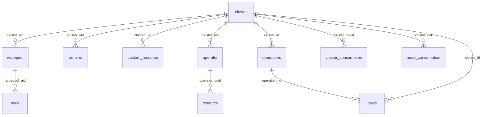

# Аналитический документ по взаимосвязям объектов KaaS

## ER-диаграмма



## Ключевые связи

### cluster — центральная сущность

- **cluster** ← nodepool (cluster_uid)
- **cluster** ← admins (cluster_uid)
- **cluster** ← custom_resource (cluster_uid)
- **cluster** ← operator (cluster_uid)
- **cluster** ← operations (cluster_id)
- **cluster** ← cluster_consumption (cluster_ci / uid)
- **cluster** ← node_consumption (cluster_uid)
- **cluster** ← tasks (cluster_id)

### Иерархия ресурсов

- **cluster** → **nodepool** → **node** (кластер содержит пулы узлов, пулы содержат узлы)
- **operator** → **resource** (операторы управляют ресурсами)

### Операционный поток

- **operations** → **tasks** (операции содержат задачи)

## Схемы

| Схема | Таблицы | Описание |
|-------|---------|----------|
| conf | cluster, nodepool, admins, custom_resource | Конфигурационные данные: кластеры, пулы узлов, админы, custom resources |
| state | node, resource, operator, cluster_consumption, node_consumption | Состояние: узлы, ресурсы, операторы, потребление |
| operation_v2 | operations, tasks | Операции и задачи |

## Связи для join-анализа

```
cluster.uid = nodepool.cluster_uid
cluster.uid = admins.cluster_uid
cluster.uid = custom_resource.cluster_uid
cluster.uid = operator.cluster_uid
cluster.uid = node_consumption.cluster_uid
cluster.uid = cluster_consumption.uid (или cluster_ci)
cluster.id / cluster.uid = operations.cluster_id
cluster.id / cluster.uid = tasks.cluster_id

nodepool.uid = node.nodepool_uid
operator.uuid = resource.operator_uuid
operations.id = tasks.operation_id
```
